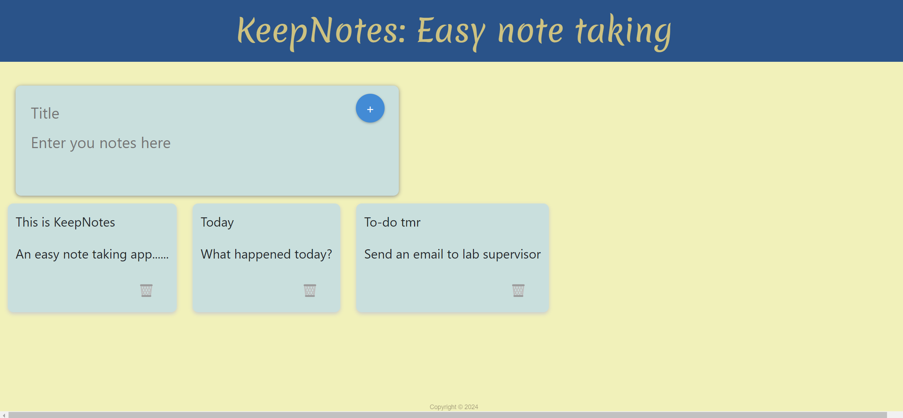

# KeepNotes: A simple notetaking application
<html><body></body></html>
  
    

**To run the application:**  
First, clone the repository into your local device.

Then
In the terminal:
```
cd KeepNotes
npm install
npm run dev
```
Paste the link into your browser.
